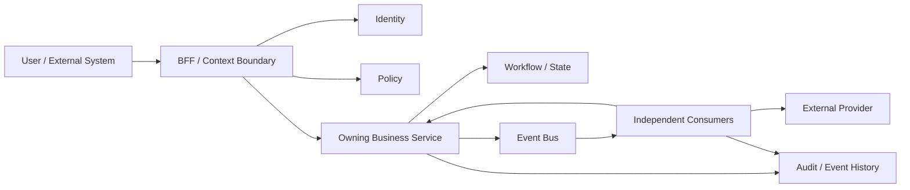
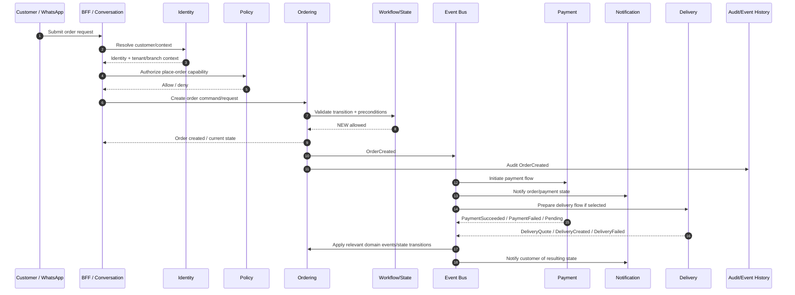

# DAWAT Flow Map — #28

> Working architecture map for the coarse-grained microservice + event-first design. This is a design-phase artifact; service/protocol details remain subject to validation.

## 1. Flow inventory

### Customer-facing flows
1. Discover restaurant / restaurant information
2. Browse menu
3. Select item / variant / modifiers
4. Cart creation and modification
5. Place order
6. Payment initiation
7. Payment completion / confirmation
8. Order status / order details
9. Modify order
10. Cancel order
11. Pickup fulfillment
12. Delivery selection / quote
13. Delivery booking / assignment
14. Delivery tracking / status
15. Customer notification delivery
16. Customer ↔ staff human takeover
17. Feedback / verified review
18. Reorder / repeat purchase

### Restaurant onboarding & configuration flows
19. Owner identity/authentication
20. Restaurant group creation
21. Branch creation/configuration
22. Connect existing/new WhatsApp number (Meta authorization/coexistence)
23. WhatsApp channel verification/configuration
24. Menu ingestion
25. Menu review / correction
26. Menu publish / version activation
27. Menu availability / schedule changes
28. Restaurant/branch policy configuration
29. Staff invite / membership management
30. Staff role/permission/scope management
31. Human takeover claim / assign / release

### Platform / commercial flows
32. Subscription selection / entitlement activation
33. Subscription lifecycle / renewal / failure / cancellation
34. Billing/payment for Dawat subscription
35. Entitlement check / capability change
36. Marketing consent / opt-in / opt-out
37. Notification template configuration
38. Delivery provider configuration

### Reliability / platform flows
39. Authentication / token exchange / capability issuance
40. Authorization / policy evaluation
41. State transition / workflow execution
42. Event publication / consumption
43. Retry / timeout / dead-letter / replay
44. Reconciliation / recovery
45. Audit / security event recording
46. Observability / correlation / tracing
47. Data deletion / anonymization / retention enforcement
48. Integration webhook ingestion
49. Projection / read-model update
50. Analytics / reporting pipeline

## 2. Canonical runtime pattern

The diagram is conceptual: not every flow invokes every component, and authorization is synchronous when an immediate decision is required. Domain events drive independent asynchronous consequences.

## 3. Flow mapping convention

Each flow will be mapped as:

`Trigger → Context/Identity → Authorization → Command/Request → Owning Service → State/Workflow → Domain Event → Consumers → External effects → Completion/Recovery`

For each flow we will also record:
- authoritative state owner
- synchronous boundary
- asynchronous events
- idempotency key
- correlation/causation
- failure/retry path
- human intervention point
- tenant/branch scope
- data classification
- audit requirements

## 4. First detailed flow

Place Order is the first reference implementation for #28 because it crosses BFF, Identity/Policy, Ordering, Menu, Payment, Notification, optional Delivery, Workflow/State and Audit while exposing both synchronous and asynchronous boundaries.

## 5. Initial flow-classification matrix

| Flow | Primary owner | Sync boundary | Async consequences |
|---|---|---|---|
| Restaurant discovery/info | Restaurant | query/read | cache/projection |
| Menu browse | Menu | query/read | projection/cache |
| Cart | Ordering | command/read | optional analytics |
| Place order | Ordering | validation + creation | payment, delivery, notification, analytics |
| Order status/details | Ordering/read model | query | none required |
| Modify order | Ordering | validation + transition | payment/delivery/notification |
| Cancel order | Ordering | validation + transition | payment/refund/delivery/notification |
| Payment initiation | Payment | create payment intent | provider result/webhook |
| Payment webhook | Payment | authenticate/accept webhook | payment state event |
| Delivery quote | Delivery | provider quote when required | cache/expiry handling |
| Delivery booking | Delivery | only if immediate confirmation required | provider callbacks/status |
| Delivery tracking | Delivery/read model | query | provider status ingestion |
| Notifications | Notification | normally none | channel delivery/retry |
| Human takeover | Conversation | claim/transition | notifications/audit |
| WhatsApp onboarding | Restaurant/Conversation | authorization + mapping | provisioning/menu/configuration |
| Menu ingestion | Menu | accept upload/request | extraction/diff/review |
| Menu publish | Menu | validate + publish | cache/projection/notification |
| Authorization | Policy | decision | audit/security event |
| Authentication/token exchange | Identity | token issuance/exchange | audit/security event |
| Subscription entitlement | Billing | eligibility/read | lifecycle events |
| Subscription lifecycle | Billing | only immediate actions | renewal/failure/events |
| Analytics | Analytics | none | event-driven |
| Audit | Audit capability | normally none | durable event/audit processing |
| Retry/recovery | Workflow/platform | none | timers/retry/replay |

## 6. Important boundary rule

A flow may cross many services, but a service must not become a generic orchestrator for unrelated domains. The owning business service owns its authoritative state. Cross-service consequences should normally be event-driven. Synchronous chains should remain shallow and exist only where the caller genuinely needs an authoritative immediate answer.

## 7. Status

- Flow inventory: **initially mapped**
- Canonical flow notation: **Mermaid**
- Place Order detailed map: **first draft**
- Remaining: map each flow's exact events, state machines, ownership, failure paths and security/data boundaries.
