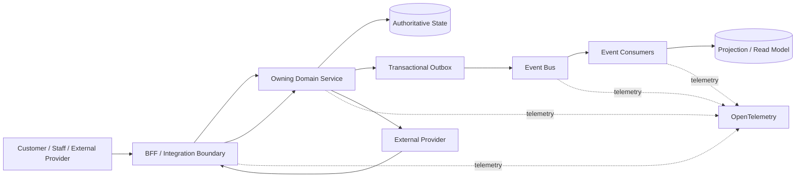

# Production Reliability Battle — Observability, Webhooks & Projections

> Design-phase validation artifact for the next architecture battle after the flow-context capability-token decision. This battle tests whether Dawat's event-first architecture remains diagnosable, trustworthy and recoverable across synchronous calls, asynchronous events, external webhooks and derived read models.

## Scope

This battle covers three tightly coupled reliability surfaces:

1. **Observability:** Session → Correlation → Trace → Event → Service → External Provider.
2. **External webhook ingestion:** provider authenticity, normalization, deduplication, ordering, replay and state validation.
3. **Projection/read models:** eventual consistency, idempotency, rebuildability, versioning and isolation from authoritative state.

The battle does not select a vendor yet. OpenTelemetry, CloudEvents and protocol standards are the reference points; concrete infrastructure remains an implementation decision.

## Current architecture under test



## Reliability invariants

- Authoritative business state lives only in the owning service.
- Events are durable facts, not commands to bypass state validation.
- Every externally supplied event is untrusted until authenticated, normalized, scoped and validated.
- Duplicate delivery must not create duplicate business effects.
- Out-of-order delivery must not corrupt state.
- Replay must be safe and auditable.
- Projection failure must not block core transactional operations.
- Projection data is never authoritative for a state-changing decision unless explicitly designated as such.
- Correlation/trace metadata improves diagnosis but is not authorization.
- Telemetry must not become an accidental PII/secrets store.
- Recovery paths must re-enter normal authorization, policy, precondition and state-transition machinery.

## Battle A — Observability

### Tests

| ID | Test | Expected result |
|---|---|---|
| O01 | One WhatsApp order crosses BFF → Ordering → event bus → Payment | One diagnosable flow with stable session + correlation context |
| O02 | One correlation produces multiple async consumers | Same correlation; distinct trace/span identities where appropriate |
| O03 | Retry creates another attempt | Attempt is visible without pretending it is a new business flow |
| O04 | Event is replayed | Original event identity/correlation/causation remain distinguishable from replay execution |
| O05 | External webhook triggers reconciliation | Provider event, local event and corrective transition are traceable |
| O06 | One service fails | Failure is attributable to service/operation/error class without requiring raw payload logging |
| O07 | Search by order ID | Support tooling can reach relevant event/trace records without making business DB the telemetry store |
| O08 | Search by correlation ID | Full flow path is discoverable across sync and async boundaries |
| O09 | High-cardinality/PII field appears in telemetry | Design rejects it or applies controlled handling |
| O10 | Trace backend unavailable | Business processing continues; observability degradation is visible but not a core dependency |

### Standards check

OpenTelemetry provides common semantic conventions across HTTP, RPC and messaging, with current RPC conventions defining client/server spans, status and error attributes. We should adopt semantic conventions rather than inventing Dawat-specific telemetry vocabulary where an existing convention fits.

### Result criteria

**PASS** if an operator can reconstruct a material journey from Session → Correlation → Trace → Event → Service → External Provider without reading application databases or raw sensitive payloads.

## Battle B — External webhook ingestion

### Threat/fault matrix

| ID | Attack/fault | Expected result |
|---|---|---|
| W01 | Invalid signature | Reject; security telemetry; no domain transition |
| W02 | Valid signature, wrong provider/resource | Reject after identity/scope validation |
| W03 | Duplicate provider event | Idempotent; no duplicate business effect |
| W04 | Same event replayed later | Rejected/absorbed according to replay policy |
| W05 | Out-of-order event | Do not regress state; reconcile or wait according to domain rules |
| W06 | Malformed payload | Reject before domain mapping |
| W07 | Valid payload for unknown local entity | Controlled quarantine/reconciliation path |
| W08 | Provider timeout causes retry | Duplicate delivery remains safe |
| W09 | Provider sends unexpected event type | Acknowledge/reject according to integration policy without inventing domain meaning |
| W10 | Webhook endpoint is flooded | Rate/resource controls prevent unbounded downstream impact |
| W11 | Signature covers insufficient message context | Fail design review; signed coverage must match trusted processing inputs |
| W12 | Webhook directly requests privileged state mutation | Reject; webhook is evidence, not arbitrary domain authority |
| W13 | Provider changes payload version | Adapter handles versioning; core domain remains stable |
| W14 | Integration adapter unavailable | Provider retry/DLQ/reconciliation path preserves recoverability |

### Ingestion invariant

```text
External Provider
    → Authenticate / Verify Signature
    → Normalize Provider Event
    → Deduplicate
    → Resolve Tenant + Resource Scope
    → Validate Current State / Preconditions
    → Owning Service Transition
    → Domain Event
```

Webhook acknowledgement should be decoupled from slow domain processing where practical, while preserving durable receipt and replay/recovery semantics.

HTTP Message Signatures (RFC 9421) provides a standard mechanism for message integrity/authenticity and explicitly discusses signature coverage, timestamps and replay. It is a reference for designing generic signed HTTP integrations; provider-specific webhook signature mechanisms remain authoritative where providers define them.

CloudEvents is a useful interoperability envelope/reference for event metadata, but adopting it does not make provider payloads trusted or eliminate Dawat's domain validation.

## Battle C — Projection/read model

| ID | Test | Expected result |
|---|---|---|
| P01 | Same domain event delivered twice | Projection remains correct/idempotent |
| P02 | Events arrive out of order | Projection detects/handles ordering requirements rather than silently corrupting view |
| P03 | Projection consumer crashes mid-update | Resume safely without duplicate visible effects |
| P04 | Projection falls behind | Core ordering/payment/delivery operations continue |
| P05 | Projection is deleted | Rebuild from durable event history where the projection is designated rebuildable |
| P06 | Event schema evolves | Versioned consumer/migration path preserves correctness |
| P07 | Projection contains stale state | State-changing operation consults authoritative owner, not stale projection |
| P08 | Tenant-scoped query | No cross-tenant records become visible |
| P09 | PII deletion/anonymization occurs | Derived stores participate in lifecycle policy |
| P10 | Analytics/reporting load spikes | Runtime transaction path remains isolated |

## Observability model

Use these identifiers distinctly:

- **sessionId:** continuous interaction context.
- **correlationId:** one flow/action execution.
- **traceId/spanId:** distributed execution telemetry.
- **eventId:** identity of one event occurrence.
- **causationId:** direct causal predecessor.
- **providerEventId:** external provider's event identity where available.
- **idempotencyKey:** deduplication identity for a specific operation.

These identifiers may be linked, but must never be collapsed into one universal ID.

## Failure taxonomy

Use controlled business outcomes for expected invalid requests and integration states. Infrastructure failures remain failures and enter retry/DLQ/recovery according to policy.

Target remains **zero unhandled/unclassified 5xx**, not zero 5xx under all operational failures.

A security mismatch should be observable as a security signal even when the external API response is a controlled 4xx.

## Initial battle result

### Observability — PASS with constraints

OpenTelemetry's current semantic conventions cover HTTP, RPC and messaging and provide standard client/server operation, status and error attributes. The architecture should adopt these conventions and add only a small Dawat correlation layer. Telemetry must remain non-authoritative and non-blocking. citeturn0search0turn0search1turn0search2

### Webhook ingestion — PASS with constraints

The proposed adapter boundary survives the threat model. The critical rule is that **authentication is not authorization and a valid provider signature is not permission to mutate arbitrary domain state**. RFC 9421 reinforces the need for sufficient signed coverage and explicit replay defenses; OWASP similarly emphasizes TLS, authentication, integrity and validation. Provider-native signature schemes remain authoritative where supplied. citeturn1search0turn3search0

CloudEvents is suitable as an interoperability envelope/reference, but it does not replace provider authentication, deduplication or domain validation. citeturn2search0

### Projection/read model — PASS with constraints

The projection model is sound provided projections remain derived and non-authoritative, consumers are idempotent, and rebuild/replay is supported where required. Stale projections must never authorize or execute state-changing operations. This preserves the existing event-first architecture without introducing a universal projection service.

### Important finding

The battle confirms a stronger invariant:

> **External events can provide evidence about external reality, but only the owning domain service can decide the corresponding internal state transition.**

This applies equally to Meta, payment providers, delivery providers and future integrations.

## Decision gate

**A — Adopt:** architecture passes and is promoted to canonical pattern.

**B — Adopt with constraints:** architecture passes with explicit boundaries/limitations or deferred implementation details.

**C — Redesign:** a core invariant fails and the event-first architecture needs material change.

**Current result: B — Adopt with constraints.**

Constraints are: provider-specific authenticity remains at the integration boundary; OpenTelemetry conventions are preferred over custom telemetry semantics; webhook events never bypass domain authorization/state transitions; projections remain non-authoritative; and telemetry cannot become a hard runtime dependency.

## Remaining implementation battles

1. Exact telemetry backend/collection topology and SLO/alert model.
2. Per-provider webhook signature/verification/replay mechanics.
3. Event envelope/versioning decision (including whether/where to use CloudEvents).
4. Projection storage/rebuild strategy and retention/lifecycle behavior.

These are implementation/pocket-time questions unless a new architectural conflict appears.

## Exit criteria

Move on when the remaining constraints have owners/implementation decisions and no architectural invariant remains ambiguous. Vendor selection can remain separate unless it changes the architectural result.
